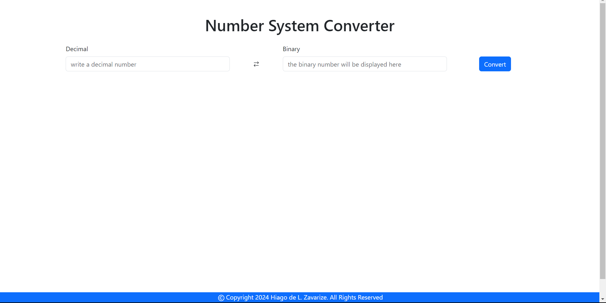

<h1>Number System Converter</h1>

This is a simple and practical number system converter. in it, for now it is possible to convert from binary to decimal and vice versa

you can test <a href="https://dec2bin-converter.vercel.app/">here</a>

New updates will soon be released including conversion options for other types of numerical systems such as hexadecimal and octal :)

